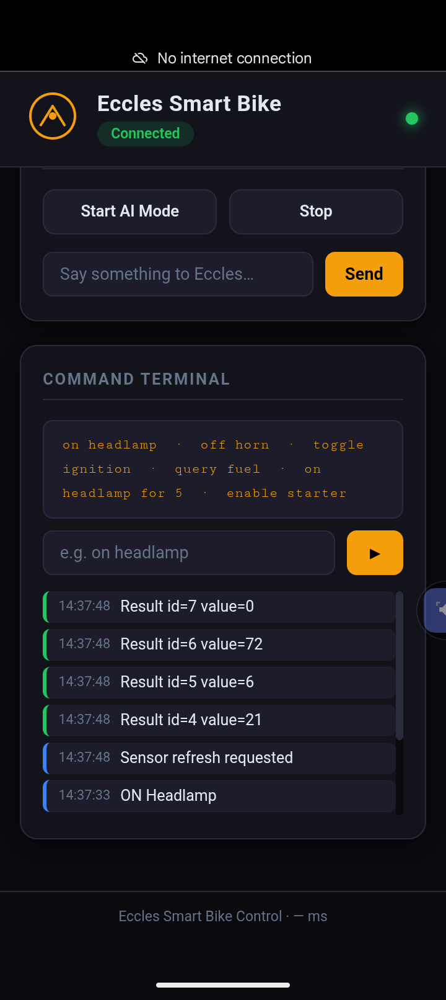
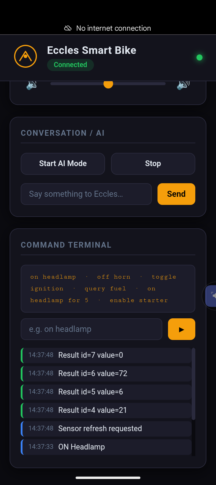
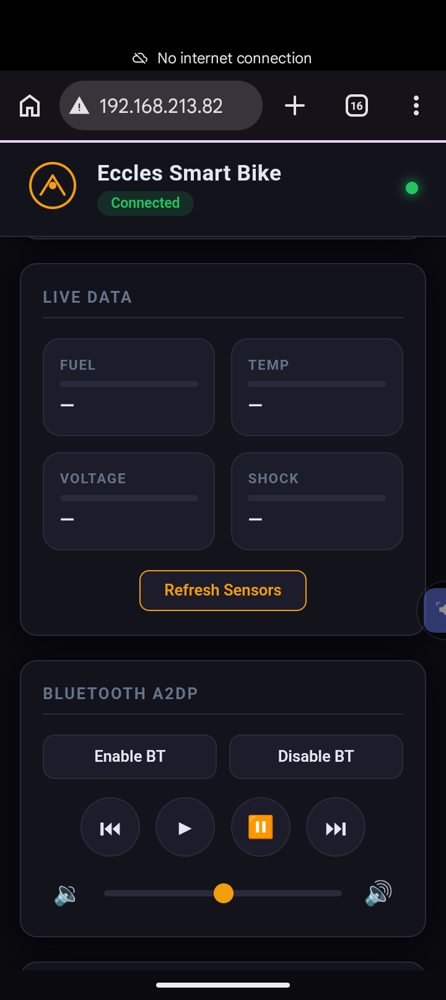
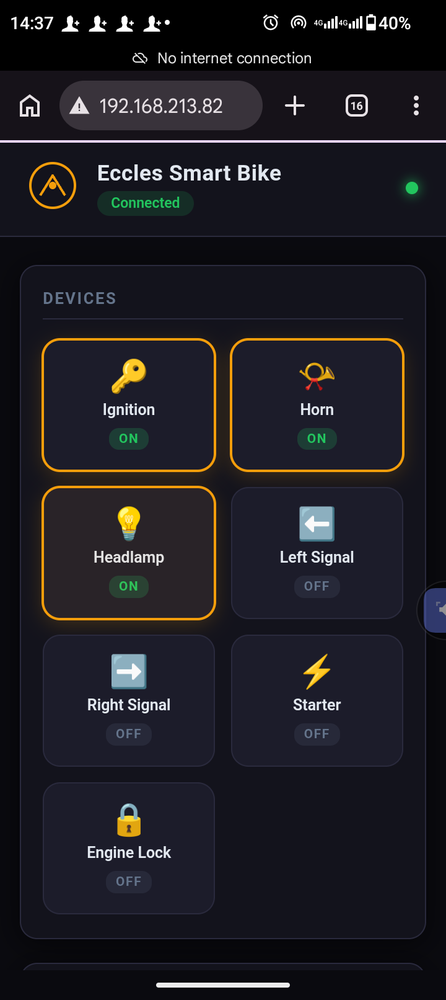
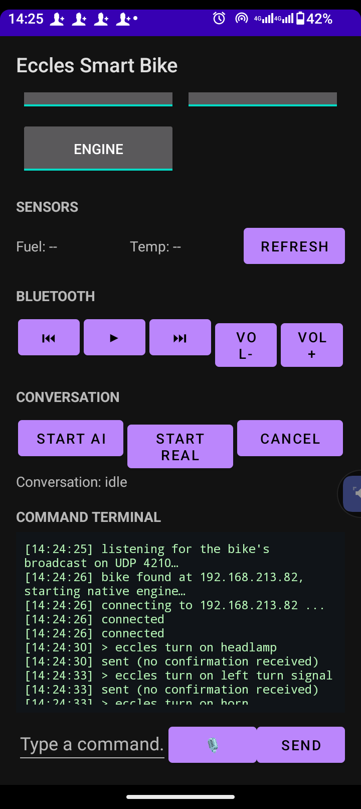
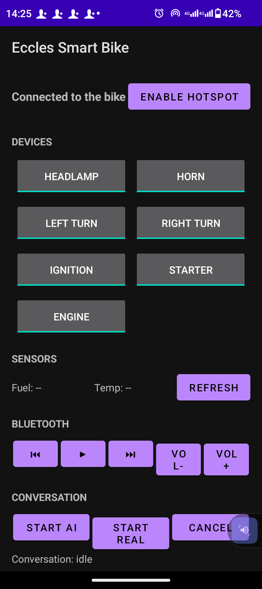
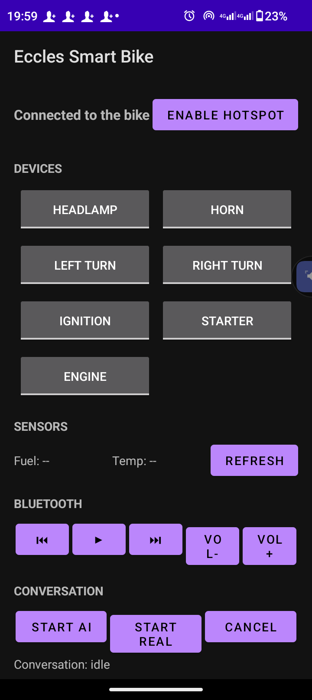
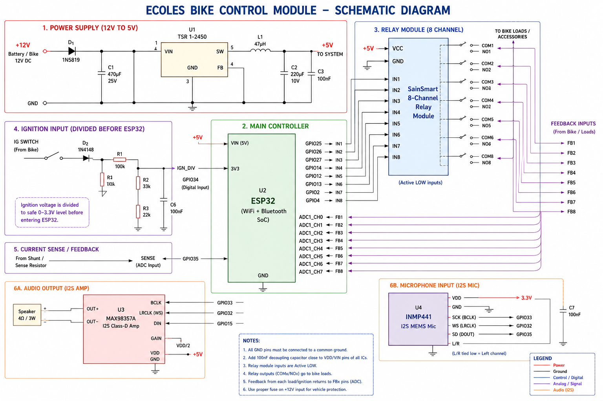

<div align="center">

# 🚲⚡ Eccles Smart Bike

### A voice-controlled, WiFi/Bluetooth-connected smart control system for a real motorcycle — built on bare-metal ESP-IDF, with a native Android companion app and a live Web UI.

**Talk to your bike. Control it from your phone. Watch it respond in real time.**

[](#-firmware)
[](#-firmware)
[](#-android-app)
[](LICENSE)
[](#-roadmap)

[Flash it now](#-quick-start-flash-in-5-minutes) • [See it in action](#-see-it-in-action) • [How it's built](#-system-architecture) • [Contribute](CONTRIBUTING.md)

</div>

---

## 🧠 What is this?

**Eccles Smart Bike** turns an ordinary motorcycle into a connected, voice-aware machine. An **ESP32** wired into the bike's ignition, horn, lights, and turn signals becomes the brain of the system — reachable over **WiFi**, **Bluetooth Classic (A2DP/AVRCP)**, and a **built-in web dashboard**, and controllable from a **purpose-built Android app** with voice recognition and text-to-speech feedback.

No cloud. No subscriptions. No third-party servers. Everything runs locally between your phone and your bike.

This repository ships **two things** for every visitor:

1. 🔧 **Ready-to-flash firmware and a ready-to-install Android APK** — so you can test the full system on real hardware in minutes, without installing a toolchain or opening an IDE.
2. 📖 **The complete, professionally organized source** — firmware, Android app, and embedded web UI — for anyone who wants to build on it, fork it, or learn from it.

---

## ✨ Highlights

| | |
|---|---|
| 🎙️ **Voice control** | Speak commands from the Android app; the bike talks back through a custom-built text-to-speech engine running entirely on the ESP32 |
| 📡 **Triple connectivity** | Control the bike over its own **WiFi hotspot + WebSocket**, over **Bluetooth Classic** (A2DP audio + AVRCP media keys), or straight from its **built-in web dashboard** |
| 🌐 **Zero-install web dashboard** | The ESP32 serves its own responsive control panel — devices, live sensors, and a raw command terminal — no app required |
| 📱 **Native Android companion app** | Purpose-built app with device controls, live sensor readouts, Bluetooth media controls, a conversational voice mode, and a raw command terminal |
| 🔊 **Custom audio pipeline** | A hand-built TTS packaging toolchain compresses voice clips into a compact on-device model, played back through DAC or I2S |
| 🧱 **Modular embedded architecture** | Clean separation between device abstraction, transport, executors, and audio — designed for real-time control on a dual-core ESP32 |
| 🔌 **Hardware feedback loop** | Every actuator (ignition, horn, headlamp, turn signals, starter) has a matching feedback pin, so the firmware always knows the real-world state |
| 🛠️ **Ported from the ground up** | Rebuilt from a buggy Arduino/PlatformIO prototype into a clean, native **ESP-IDF** implementation — same behavior, dramatically more stable foundation |

---

## 🖼️ See it in action

### Web Dashboard
Served directly by the ESP32 — open a browser, connect to the bike's hotspot, and you're in control.

<p align="center">
  
  
  <br/>
  
  
</p>

### Android Companion App
Devices, sensors, Bluetooth media, voice conversation mode, and a raw terminal — all in one app.

<p align="center">
  
  
  
</p>

### Wiring & Hardware
<p align="center">
  
</p>

> More photos of the real debugging process — multimeters, breadboards, and late nights chasing a stubborn DAC — are in [`docs/images/debugging/`](docs/images/debugging).

---

## 🚀 Quick Start: flash in 5 minutes

You don't need to compile anything to try this out. Pre-built binaries are included in this repo.

### 1. Flash the firmware (ESP32)

Requires [`esptool`](https://github.com/espressif/esptool) (`pip install esptool`) and a USB cable.

```sh
esptool.py --chip esp32 --port <YOUR_PORT> --baud 460800 write_flash \
  0x1000   firmware/prebuilt/bootloader.bin \
  0x10000  firmware/prebuilt/firmware.bin \
  0x190000 firmware/prebuilt/littlefs.bin
```

Replace `<YOUR_PORT>` with your serial port (e.g. `COM5` on Windows, `/dev/ttyUSB0` on Linux, `/dev/cu.usbserial-XXXX` on macOS).

Full instructions, partition layout, and troubleshooting: **[`firmware/README.md`](firmware/README.md)**

### 2. Install the Android app

Grab the APK straight from this repo — no Play Store, no build step:

📦 **[`android-app/release/EcclesSmartBike.apk`](android-app/release/EcclesSmartBike.apk)**

Sideload it, allow the microphone and WiFi permissions, connect to the bike's hotspot, and you're talking to your bike.

Full instructions: **[`android-app/README.md`](android-app/README.md)**

### 3. Or just open the web dashboard

Once the firmware is flashed, connect any browser to the ESP32's WiFi hotspot and open its IP address — the full dashboard in **[`web-ui/`](web-ui)** loads automatically, straight from the device.

---

## 🧱 System Architecture

```
                        ┌─────────────────────────┐
                        │      Android App        │
                        │  voice · UI · terminal   │
                        └────────────┬─────────────┘
                                     │ WiFi (WebSocket)  /  Bluetooth Classic (A2DP · AVRCP)
                                     ▼
 ┌────────────────────────────────────────────────────────────────┐
 │                         ESP32 Firmware                         │
 │                                                                  │
 │   Transport ──▶ Executor / Executors ──▶ DeviceManager           │
 │        │                                     │                  │
 │        ▼                                     ▼                  │
 │   Web Server + WebUI (littlefs)      Hardware Devices + Pins     │
 │   (index.html / app.js / style.css)  (ignition, horn, lamps,     │
 │                                        signals, sensors)         │
 │        │                                                          │
 │        ▼                                                          │
 │   Audio (DAC / I2S) ◀── Eccles TTS engine ◀── StaticModel.eccles  │
 └────────────────────────────────────────────────────────────────┘
                                     ▲
                                     │ packages voice clips into a compact binary model
                        ┌────────────┴─────────────┐
                        │   Eccles TTS Packager      │
                        │  (host-side C++ tool)      │
                        └────────────────────────────┘
```

**Repository layout:**

```
eccles-smart-bike/
├── firmware/            ESP32 firmware — pre-built binaries + full ESP-IDF source
│   ├── prebuilt/        Flash-ready .bin files (bootloader, app, filesystem)
│   └── source/          Full ESP-IDF project source
├── android-app/         Android companion app
│   ├── release/         Ready-to-install .apk
│   └── source/          Full Android Studio project source
├── web-ui/              The on-device web dashboard source (HTML/CSS/JS)
├── docs/                Screenshots, schematics, and debugging photos
├── CONTRIBUTING.md
├── CHANGELOG.md
└── LICENSE
```

---

## 🔧 What's inside the firmware

- **Modular device architecture** — a `DeviceManager` abstracts every physical actuator (ignition, horn, headlamp, turn signals, starter) behind a common interface, each paired with a real hardware feedback pin.
- **Real-time transport layer** — a unified `Transport`/`Executor` pipeline accepts commands from WiFi WebSocket, Bluetooth, or the web terminal and dispatches them identically.
- **On-device text-to-speech** — the **Eccles TTS Packager**, a standalone host-side C++ tool, compresses `.wav` voice clips into a single packed binary (`StaticModel.eccles`) plus an auto-generated header, which the firmware plays back through the internal DAC or an external I2S codec.
- **Bluetooth Classic stack** — A2DP audio streaming and AVRCP media control, so the bike can act as a Bluetooth audio sink and be controlled with play/pause/next/volume.
- **Built-in web server** — serves the dashboard directly from a LittleFS partition, with a live WebSocket channel for real-time device and sensor updates.
- **NVS-backed configuration** — persistent settings survive power cycles using native `nvs_flash`.

Full technical breakdown, including a complete Arduino → ESP-IDF API migration table, is in **[`firmware/source/PORT_NOTES.md`](firmware/source/PORT_NOTES.md)**.

## 📱 What's inside the Android app

- **Device controls** — headlamp, horn, turn signals, ignition, starter, and engine, all in one screen.
- **Live sensors** — fuel and temperature gauges refreshed in real time.
- **Bluetooth media panel** — play/pause/skip and volume controls for AVRCP.
- **Conversation mode** — start a live voice conversation with the bike (AI mode) or a direct real-time voice link.
- **Command terminal** — type or speak raw commands for debugging and advanced control.
- **Automatic discovery** — the app watches for the bike's WiFi hotspot and connects automatically.

## 🌐 What's inside the web UI

A clean, dependency-free dashboard (`index.html` / `app.js` / `style.css`) served directly from the ESP32's filesystem, mirroring the Android app's device, sensor, and terminal panels — no app install required to use it.

---

## 🎙️ The Eccles TTS Packager

A big part of this project's personality: the bike doesn't beep, it *talks*. The **Eccles TTS Packager** is a small, dependency-free host-side C++17 tool that:

- scans a folder of `.wav` voice clips,
- resamples/normalizes them to a shared format (rate, bit depth, channels),
- strips trailing silence,
- and packs everything into one compact binary (`StaticModel.eccles`) with an auto-generated C++ header — ready to be flashed straight to the device's filesystem partition.

It has zero ESP-IDF or Arduino dependency, so it builds and runs anywhere. Source lives in `firmware/source/eccles/tools/`.

---

## 🩹 Ported from a buggy Arduino prototype

This project began life as an **Arduino/PlatformIO** firmware — the original prototype is preserved here for history and comparison:

🔗 **[igwe-starking/eccles-esp-arduino-smart-bike](https://github.com/igwe-starking/eccles-esp-arduino-smart-bike)**

That version worked, but it was fragile: Arduino-core abstractions over GPIO, ADC, DAC, WiFi, and Bluetooth introduced subtle bugs and instability, most notably a DAC audio fault that took roughly **two weeks of hardware-level debugging** (see [`docs/images/debugging/`](docs/images/debugging)) to finally track down.

The firmware in this repository is a **from-scratch, line-by-line port to pure ESP-IDF** — no Arduino core, no Arduino libraries. Every module boundary, class name, and piece of original logic was preserved; only the underlying framework calls were swapped for their native ESP-IDF equivalents (`gpio_set_level` instead of `digitalWrite`, `esp_wifi`/`esp_http_server` instead of `WiFi.h`/`ESPAsyncWebServer`, raw `nvs` instead of Arduino `Preferences`, and so on). The result is the same system, same behavior, on a dramatically more stable and transparent foundation.

The complete migration table is documented in [`firmware/source/PORT_NOTES.md`](firmware/source/PORT_NOTES.md).

---

## 🛣️ Roadmap

- [ ] Re-enable AVRCP absolute volume / volume up-down now that a current ESP-IDF AVRC API is available
- [ ] Migrate audio streaming from the legacy `driver/i2s.h` to the modern `driver/i2s_std.h` channel API
- [ ] Improve TTS synthesis quality
- [ ] Add a secure communication layer between the Android app and the ESP32
- [ ] Firmware signing / update protection

Have an idea or ran into something? See **[CONTRIBUTING.md](CONTRIBUTING.md)**.

---

## 📜 License

Released under the **[MIT License](LICENSE)**.

## 👤 Author

**Nwobodo Ecclesiastes Chidera** — a.k.a. **Igwe Starking**

<div align="center">

If this project sparked an idea for your own build, a ⭐ helps others find it.

</div>
